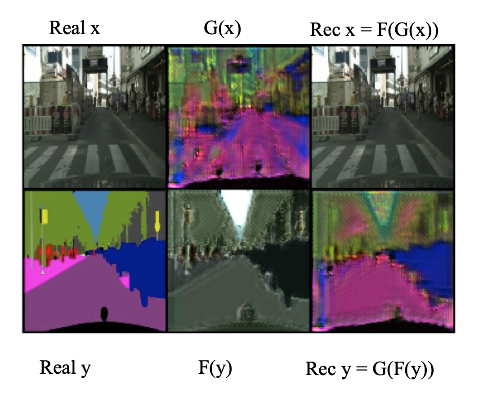

# DeepFlowImageTranslation

## Description
An unsupervised image-to-image translation built on top of https://github.com/junyanz/CycleGAN

The generator is replaced with a RealNVP flow model to ensure cycle consistency.

## Datasets
Facades and Cityscapes datasets can be downloaded using this script
https://github.com/junyanz/pytorch-CycleGAN-and-pix2pix/blob/master/scripts/download_cyclegan_model.sh

## Sample Training Command
python train.py --name facades --model flowgan --gpu_ids "[0, 1]"

## Sample output

